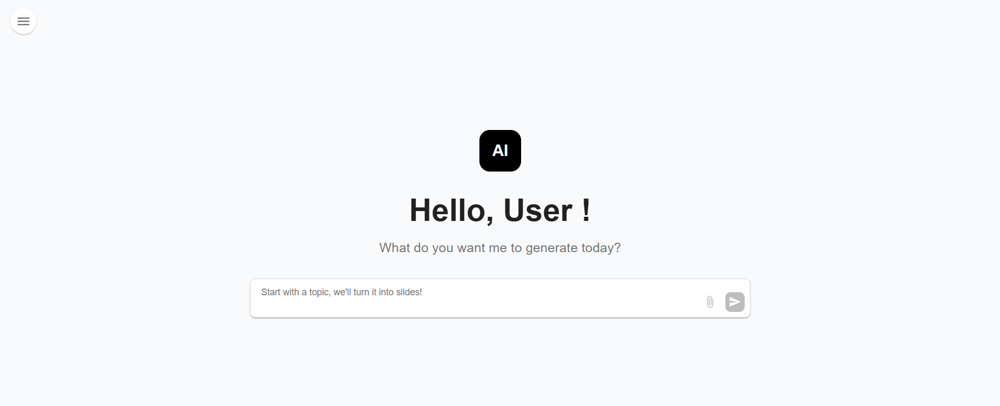
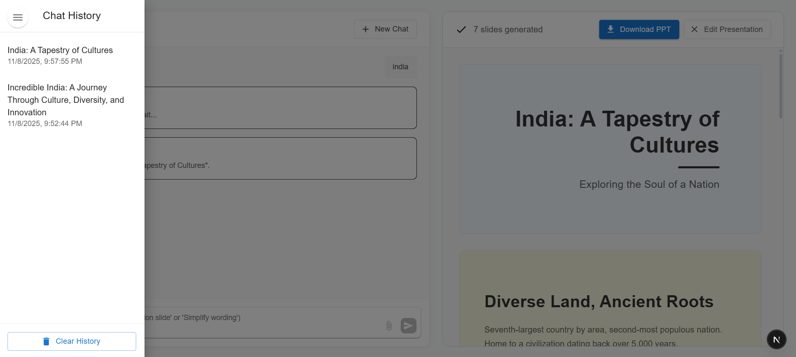
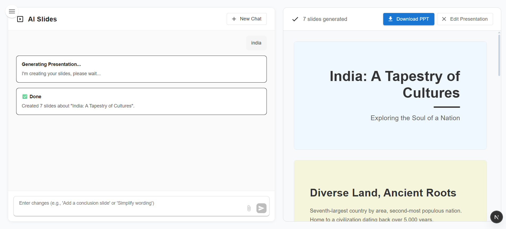

# AI Presentation Generator

An interactive **AI-powered presentation generator** built with **Next.js 16**, **Material UI**, and **Google Gemini API**.  
Users can chat naturally to request a topic — and the app instantly creates a **fully structured PowerPoint presentation** with title, content, colors, and live slide preview.

---

## 🔗 Links

- **Live Demo**: [https://ai-ppt-maker-sigma.vercel.app/](https://ai-ppt-maker-sigma.vercel.app/)
- **GitHub Repository**: [https://github.com/ajps208/AI_PPT_MAKER](https://github.com/ajps208/AI_PPT_MAKER)

## 🚀 Features

- **💬 AI Chat Interface** – Conversational UI that simulates thinking and research steps.
- **📊 Automatic Presentation Generation** – Uses Google **Gemini 2.5 Flash** to create well-structured slides.
- **🖼️ Real-time Slide Preview** – Beautiful Material UI-based layout with unique colors and dynamic content.
- **📥 Download as PPT** – Export generated slides as a `.pptx` file.
- **⚡ Smart UX Flow** – “Hello User” greeting page, animated thinking steps, and interactive transitions.
- **💾 Extensible Design** – Ready for adding chat history using Local or Session Storage.

---

## 🧩 Tech Stack

| Layer                | Technology              |
| -------------------- | ----------------------- |
| **Frontend**         | Next.js 16 (App Router) |
| **UI Library**       | Material UI             |
| **AI Engine**        | Google Gemini 2.5 Flash |
| **Styling**          | MUI + sx prop           |
| **PPT Generator**    | pptxgenjs               |
| **API Handling**     | Next.js Route Handlers  |
| **State Management** | React useState          |

## 🚀 Getting Started

### Prerequisites

- Node.js (v14 or higher)
- npm or yarn

### 1. Clone the Repository

```bash
git clone https://github.com/ajps208/AI_PPT_MAKER.git
cd AI_PPT_MAKER
```

### 2. Install dependencies:

```bash
npm install
```

### 4 Add Your Gemini API Key

```bash
Create a .env.local file in the root directory:
GEMINI_API_KEY=your_gemini_api_key_here
```

### 4. Start the development server:

```bash
npm run dev
```

### Open [http://localhost:3000](http://localhost:3000) in your browser

## 💡 How It Works

1. Enter any **topic** in the chat (e.g., _“The Future of Artificial Intelligence”_).
2. The app simulates **Thinking**, **Researching**, and **Generating** steps.
3. The backend endpoint **`/api/generate`** calls **Gemini 2.5 Flash** to create a strict JSON slide structure.
4. The slides are rendered in the **PPT Viewer** on the right.
5. Click **Download** to export the presentation as a **.pptx** file.

### 🧠 Example API Response

```bash
{
  "title": "Artificial Intelligence in Education",
  "slideCount": 6,
  "slides": [
    {
      "id": 1,
      "type": "title",
      "heading": "Artificial Intelligence in Education",
      "subtitle": "Transforming Learning for the Future",
      "bgColor": "#7a9b8e"
    },
    {
      "id": 2,
      "heading": "What is AI?",
      "content": "Definition of AI\nCore Concepts\nExamples in Daily Life",
      "bgColor": "#8ba299"
    }
  ]
}
```

## 📸 Screenshots





## 📝 License

This project is open source and available for educational purposes.

## 🤝 Contributing

Contributions, issues, and feature requests are welcome!

1. Fork the repository
2. Create your feature branch (`git checkout -b feature/AmazingFeature`)
3. Commit your changes (`git commit -m 'Add some AmazingFeature'`)
4. Push to the branch (`git push origin feature/AmazingFeature`)
5. Open a Pull Request

## 📧 Contact

Project Link: [https://github.com/ajps208/AI_PPT_MAKER](https://github.com/ajps208/AI_PPT_MAKER)
Deployed Link: [https://ai-ppt-maker-sigma.vercel.app/](https://ai-ppt-maker-sigma.vercel.app/)

---

**Enjoy the game! Can you reach 2048?** 🎯

⭐ Star this repo if you enjoyed playing!
